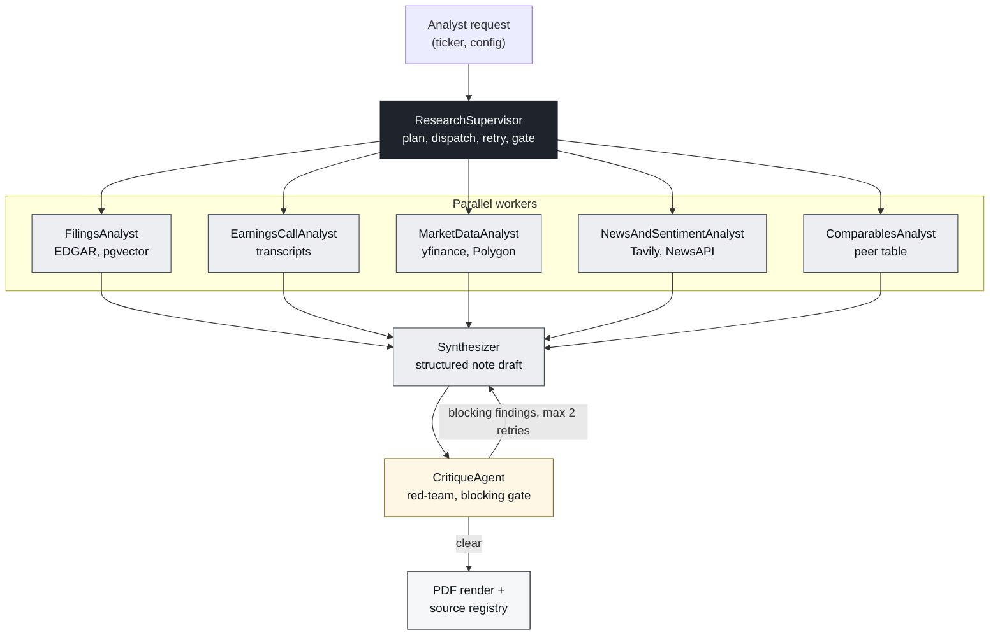

# rbc-research-agent-platform

A hierarchical multi-agent equity research synthesis platform that compresses the sell-side initiation workflow into an auditable two-minute pipeline.

## What this is

Sell-side initiation notes take a junior analyst one to two weeks to produce. The bulk of that time is mechanical: pulling the latest 10-K and 10-Qs, listening to the last four earnings calls, scraping news, building a comparables table, and writing the first draft. The judgement work, the part that matters, is a thin layer on top of a thick foundation of retrieval and synthesis.

This project models the foundation. It is a working prototype of internal tooling a sell-side research desk could build to compress the mechanical phase from weeks to minutes while preserving auditability. A LangGraph supervisor coordinates seven specialised worker agents that ingest filings, transcripts, market data, news, and comparables, then synthesise a structured note that carries inline citations back to source artifacts. A critique agent red-teams the draft before it is allowed to publish.

The architecture is deliberately conservative. Every claim in the output is traceable to a source hash. Every agent invocation is traced in Langfuse with token cost and latency. Every external dependency sits behind a retry policy and a circuit breaker. The goal is not to replace an analyst, it is to give one a defensible first draft.

## Live demo

Production: https://rbc-research-platform.onrender.com

Demo walkthrough: pending.

## Architecture



Source for the diagram is checked in at `docs/diagrams/architecture.mmd`. Detailed architecture, agent contracts, and design rationale live in `docs/`.

## Agents

| Agent | Responsibility | Primary sources |
|---|---|---|
| ResearchSupervisor | Plan, dispatch, monitor, finalise | n/a |
| FilingsAnalyst | MD&A deltas, segment performance, risk factor evolution | SEC EDGAR |
| EarningsCallAnalyst | Tone shift, guidance changes, Q&A specificity | Transcripts |
| MarketDataAnalyst | Performance, vol, beta, drawdown vs sector and SPX | yfinance, Polygon |
| NewsAndSentimentAnalyst | Theme clustering, catalyst classification | Tavily, NewsAPI |
| ComparablesAnalyst | Peer set, EV/EBITDA, EV/Sales, P/E, P/B percentiles | yfinance, Polygon |
| CritiqueAgent | Red-team unsupported claims, contradictions, citation gaps | Draft note |
| Synthesizer | Compose final note conditioned on all worker outputs | All of the above |

## Tech stack

Backend
- Python 3.12, FastAPI, Pydantic v2
- LangGraph for orchestration, LangChain only as needed
- Anthropic SDK directly: Claude Sonnet for synthesis and critique, Claude Haiku for extraction
- PostgreSQL 16 with pgvector, Redis, arq for background jobs
- SQLAlchemy 2.x async, httpx, tenacity
- Langfuse v4, structlog, prometheus-client

Frontend
- React 18, TypeScript strict, Vite
- TanStack Query, Tailwind, shadcn/ui, Recharts
- Server-Sent Events for live agent traces

Infra
- Docker, docker-compose, Render
- GitHub Actions: lint, type-check, unit, integration, evals

Versions are pinned in `apps/api/pyproject.toml` and `apps/web/package.json`.

## Local development

Requirements: Docker, Docker Compose, Python 3.12, Node 20, pnpm 9.

```
cp .env.example .env
make install
make up        # full stack via docker compose
make test      # backend tests
make lint      # ruff + eslint
make typecheck # mypy + tsc
```

Run the API or the web app standalone:

```
cd apps/api && uvicorn src.main:app --reload
cd apps/web && pnpm dev
```

All available targets are documented via `make help`.

## Evaluation

Evals run against a pinned set of 12 tickers spanning sectors and market caps. Each ticker has a hand-authored gold-standard note covering thesis, three risks, and three recent catalysts. The harness scores:

- Citation completeness: every numeric claim mapped to a source
- Factual accuracy: curated yes/no questions per ticker
- Risk recall vs the gold-standard risk set
- Hallucination rate: claims unsupported by retrieved sources
- Latency p50 and p95 per agent and end-to-end
- USD cost per run

Current scores: pending first full pipeline implementation. See `docs/evaluation.md` for methodology.

## Limitations

This is portfolio infrastructure, not a regulated production system. A real deployment inside a bank would differ in at least the following ways. Identity and entitlement enforcement would route through the firm's IDP and a fine-grained authorization service. Source ingestion would use licensed feeds, not free-tier APIs. The model layer would sit behind a firm-approved gateway with logging, DLP, and model risk management sign-off. Output would be flagged with a research compliance review queue before any analyst could publish externally. None of that is built here. What is built is the agent topology, the auditability surface, and the eval harness, which are the parts most worth showing.

## Roadmap

- Streaming agent trace UI with cancellation
- Scheduled overnight runs across a watchlist with delta surfacing
- Multi-currency support and FX-adjusted comparables
- Optional desk-specific style overlays for the final note

## License

MIT. See `LICENSE`.

---

Built by Bharath Kumar Rajesh
thebharath.co | github.com/thebharathkumar | bharath.kr702@gmail.com
